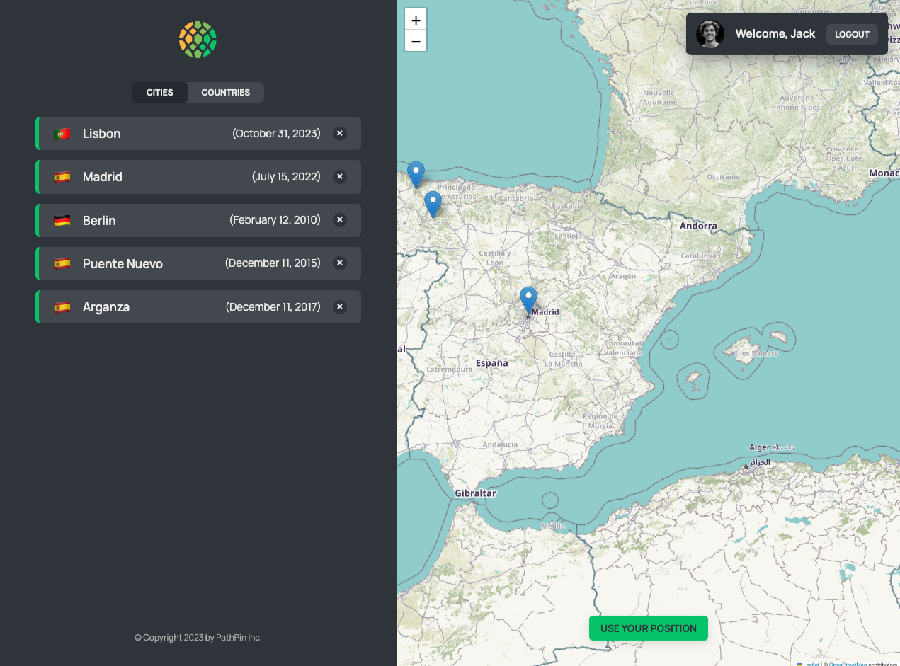
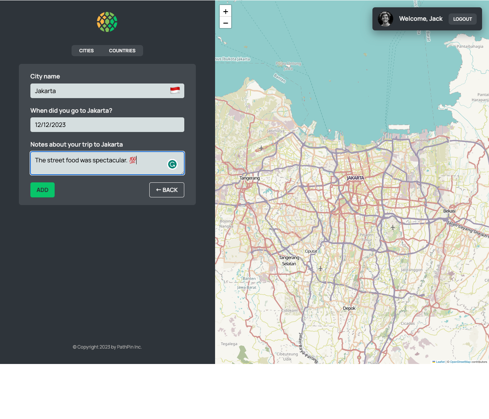

# PathPin 
- An advanced travel-tracking application designed to enable users to effectively log and visualize their travel experiences on a global scale.
- Developed with a focus on seamless user navigation, the application employs a Single Page Application (SPA) architecture, realized through the integration of React Router with Vite.

# Key Highlights
> **SPA Architecture**: Ensures fluid and uninterrupted user navigation, enhancing the overall user experience.
> 
> **Modular React Design**: Adopts React’s compound component patterns, offering a codebase that is both scalable and maintainable.
> 
> **State Management Proficiency**: Showcases expertise in React's core functionalities, including adept use of the useReducer hook for managing complex state logic, and the createContext API for effective global data handling across component trees.
> 
> **Geolocation-Enabled Mapping Interface**: Features a sophisticated mapping interface with real-time tracking capabilities, providing users with detailed geographical and city information.
> 
> **Performance Optimization**: Prioritizes performance and user experience, demonstrating the application’s capability in handling state-of-the-art web technologies.

# Design & Layout 
> Homepage
> 
>
> Pricing Page
> 
>
> App Layout 
> 
>
> App Layout V2
>  
